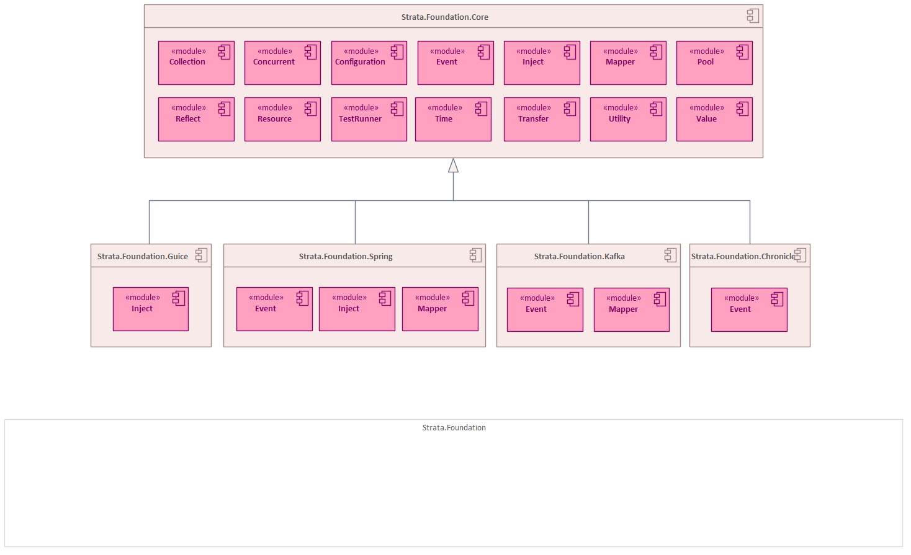

# Strata.Foundation

[](https://opensource.org/licenses/Apache-2.0)
[]()
[]()

Foundational components and utilities for building robust, scalable enterprise applications in the Strata Framework Set. This library provides core abstractions, dependency injection capabilities, event handling, and integration support for Spring Framework and Apache Kafka.

## Features

- **Core Abstractions**: Essential interfaces and utilities for enterprise application development
- **Dependency Injection**: Advanced IoC container abstractions with Spring Framework and Guice integration
- **Event-Driven Architecture**: Comprehensive event handling and messaging abstractions
- **Apache Kafka Integration**: Type-safe Kafka producers, consumers, and serialization support
- **Chronicle Integration**: High-performance persistent data structures and event streaming
- **Spring Framework Extensions**: Enhanced dependency injection scopes and configuration
- **Utility Collections**: Advanced data structures including MultiMap, MultiSet, and persistent collections
- **Type Safety**: Strongly-typed APIs with generic support and reflection utilities

## Architecture

The Strata.Foundation framework follows a modular architecture with clear separation of concerns:



```
┌─────────────────────────────────────┐
│          Application Layer          │
├─────────────────────────────────────┤
│  Strata.Foundation.Spring/Guice     │
│  Strata.Foundation.Kafka/Chronicle  │
├─────────────────────────────────────┤
│       Strata.Foundation.Core        │
├─────────────────────────────────────┤
│           JVM Platform              │
└─────────────────────────────────────┘
```

Each component builds upon the core abstractions while providing specialized functionality for specific use cases and technologies.

## Components

### Strata.Foundation.Core

The foundational component that provides essential abstractions and utilities for enterprise application development:

**Modules:**
- `strata.foundation.core.action` - Action and command abstractions
- `strata.foundation.core.collection` - Enhanced collection utilities and extensions
- `strata.foundation.core.concurrent` - Concurrency utilities and thread-safe operations
- `strata.foundation.core.configuration` - Configuration management abstractions
- `strata.foundation.core.container` - Advanced container types (MultiMap, MultiSet, Pair, Triple, Quadruple, Holder)
- `strata.foundation.core.event` - Event system abstractions (senders, receivers, completable results)
- `strata.foundation.core.exception` - Exception handling utilities and custom exceptions
- `strata.foundation.core.inject` - Dependency injection abstractions and IoC container interfaces
- `strata.foundation.core.mapper` - Object mapping abstractions and utilities
- `strata.foundation.core.pool` - Resource pooling and lifecycle management
- `strata.foundation.core.reflect` - Type-safe reflection utilities and type literals
- `strata.foundation.core.resource` - Resource management and lifecycle abstractions
- `strata.foundation.core.stream` - Enhanced stream processing capabilities
- `strata.foundation.core.testrunner` - Testing utilities and test runner abstractions
- `strata.foundation.core.time` - Time and temporal utilities
- `strata.foundation.core.transfer` - Data transfer objects and serialization support
- `strata.foundation.core.utility` - General utilities (generators, comparators, synchronizers, Optional extensions)
- `strata.foundation.core.value` - Value objects and immutable data structures

### Strata.Foundation.Guice

Google Guice integration component providing dependency injection capabilities with custom scopes:

**Modules:**
- `strata.foundation.guice.inject` - Guice-specific dependency injection implementations
  - Custom scopes (ThreadScoped, OperationScoped)
  - GuiceInjector implementation
  - AbstractModule base class
  - Properties-based module configuration
  - Provider adapters and scope management

### Strata.Foundation.Spring

Spring Framework integration component that extends core abstractions with Spring-specific implementations:

**Modules:**
- `strata.foundation.spring.event` - Spring event integration
  - Kafka template-based event senders
  - Spring-compatible event abstractions
- `strata.foundation.spring.inject` - Enhanced Spring dependency injection
  - Custom scopes (ThreadScoped, OperationScoped, RequestScoped, PrototypeScoped, SingletonScoped)
  - Operation context management
  - Bean inspection and introspection utilities
  - Spring-compatible injector implementation
- `strata.foundation.spring.mapper` - Object mapping integration
  - Strata object mapper providers
  - Model resolvers and context resolvers

### Strata.Foundation.Kafka

Apache Kafka integration component providing type-safe messaging capabilities:

**Modules:**
- `strata.foundation.kafka.event` - Kafka event handling
  - Abstract Kafka event senders and receivers
  - Avro-specific event handling
  - Configuration providers (Properties-based, Confluent)
  - Topic and key providers
  - Group ID management
- `strata.foundation.kafka.mapper` - Kafka serialization
  - JSON serializers and deserializers
  - Avro object mappers and serialization modifiers
  - Context resolvers for object mapping

### Strata.Foundation.Chronicle

Chronicle Map/Queue integration component for high-performance persistent data structures and event streaming:

**Modules:**
- `strata.foundation.chronicle.event` - Chronicle-based event handling
  - Chronicle event senders and receivers
  - Composite and partitioned event senders
  - Multicast event distribution
  - Thread-local excerpt appenders
  - Action abstractions and composite exception handling

## Installation

### Gradle

Add the following dependencies to your `build.gradle`:

```gradle
dependencies {
    implementation 'strata.foundation:strata-foundation-core:1.0-SNAPSHOT'
    implementation 'strata.foundation:strata-foundation-guice:1.0-SNAPSHOT'
    implementation 'strata.foundation:strata-foundation-spring:1.0-SNAPSHOT'
    implementation 'strata.foundation:strata-foundation-kafka:1.0-SNAPSHOT'
    implementation 'strata.foundation:strata-foundation-chronicle:1.0-SNAPSHOT'
}
```

### Maven

Add the following dependencies to your `pom.xml`:

```xml
<dependencies>
    <dependency>
        <groupId>strata.foundation</groupId>
        <artifactId>strata-foundation-core</artifactId>
        <version>1.0-SNAPSHOT</version>
    </dependency>
    <dependency>
        <groupId>strata.foundation</groupId>
        <artifactId>strata-foundation-guice</artifactId>
        <version>1.0-SNAPSHOT</version>
    </dependency>
    <dependency>
        <groupId>strata.foundation</groupId>
        <artifactId>strata-foundation-spring</artifactId>
        <version>1.0-SNAPSHOT</version>
    </dependency>
    <dependency>
        <groupId>strata.foundation</groupId>
        <artifactId>strata-foundation-kafka</artifactId>
        <version>1.0-SNAPSHOT</version>
    </dependency>
    <dependency>
        <groupId>strata.foundation</groupId>
        <artifactId>strata-foundation-chronicle</artifactId>
        <version>1.0-SNAPSHOT</version>
    </dependency>
</dependencies>
```

### Repository Configuration

This package is published to GitHub Packages. Add the repository to your build configuration:

```gradle
repositories {
    maven {
        name "GitHubPackages"
        url "https://maven.pkg.github.com/StrataFrameworkSet/repository"
        credentials {
            username = project.findProperty("gpr.user") ?: System.getenv("USERNAME")
            password = project.findProperty("gpr.key") ?: System.getenv("TOKEN")
        }
    }
}
```

## Usage

### Basic Event Handling

```java
import strata.foundation.core.event.IEventSender;
import strata.foundation.core.event.ICompletableSendResult;

// Using core event abstractions
IEventSender<MyEvent> sender = createEventSender();
ICompletableSendResult<MyEvent> result = sender.send(new MyEvent());
```

### Dependency Injection with Spring

```java
import strata.foundation.spring.inject.ThreadScoped;
import strata.foundation.spring.inject.OperationScoped;

@ThreadScoped
public class ThreadScopedService {
    // Service implementation
}

@OperationScoped
public class OperationScopedService {
    // Service implementation
}
```

### Dependency Injection with Guice

```java
import strata.foundation.guice.inject.ThreadScoped;
import strata.foundation.guice.inject.OperationScoped;
import strata.foundation.guice.inject.AbstractModule;

public class MyModule extends AbstractModule {
    @Override
    protected void configure() {
        bind(MyService.class).in(ThreadScoped.class);
    }
}
```

### Kafka Integration

```java
import strata.foundation.kafka.event.AbstractKafkaEventSender;

public class MyEventSender extends AbstractKafkaEventSender<MyEvent> {
    // Kafka-specific event sender implementation
}
```

### Chronicle Integration

```java
import strata.foundation.chronicle.event.ChronicleEventSender;

// High-performance persistent event handling
ChronicleEventSender<MyEvent> chronicleSender = new ChronicleEventSender<>();
```

### Advanced Collections

```java
import strata.foundation.core.container.MultiMap;
import strata.foundation.core.container.Pair;

MultiMap<String, Integer> multiMap = new MultiMap<>();
multiMap.put("key", 1);
multiMap.put("key", 2);

Pair<String, Integer> pair = new Pair<>("first", 42);
```

## Requirements

- Java 11 or later
- Spring Boot 3.1.3 or later (for Spring integration)
- Apache Kafka (for Kafka integration)
- Chronicle Map/Queue (for Chronicle integration)
- Google Guice 7.0+ (for Guice integration)
- Gradle 7.0+ or Maven 3.6+

## Building from Source

```bash
# Clone the repository
git clone https://github.com/StrataFrameworkSet/Strata.Foundation.git
cd Strata.Foundation

# Build all components
./gradlew build

# Run tests
./gradlew test

# Publish to local repository
./gradlew publishToMavenLocal
```

### Development Setup

```bash
# Initialize development environment
yarn dev-init

# Clean build artifacts
yarn clean

# Deep clean (including node_modules)
yarn deep-clean

# Build and test
yarn test
```

## Documentation

- Tbd 

## License

This project is licensed under the Apache License 2.0 - see the [LICENSE](LICENSE) file for details.

## Support

- **Issues**: [GitHub Issues](https://github.com/StrataFrameworkSet/Strata.Foundation/issues)

## Project Status

This project is under active development. The current version is 1.0-SNAPSHOT and is not yet considered stable for production use.


